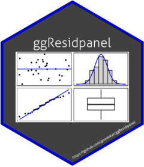
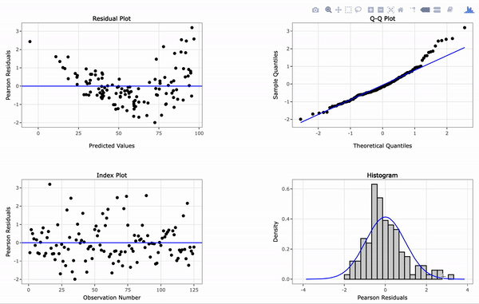

```{r setup, include = FALSE}
knitr::opts_chunk$set(
  echo = TRUE,
  warning = FALSE,
  message = FALSE,
  fig.path = "inst/figures/readme-"
)
```

# ggResidpanel <a href="https://goodekat.github.io/ggResidpanel/"></a>

<!-- badges: start -->
[](https://cran.r-project.org/package=ggResidpanel)
[](https://lifecycle.r-lib.org/articles/stages.html#stable)
[](https://github.com/goodekat/ggResidpanel/actions/workflows/R-CMD-check.yaml)
[](https://cran.r-project.org/package=ggResidpanel)
[](https://cran.r-project.org/package=ggResidpanel)
[](https://app.codecov.io/gh/goodekat/ggResidpanel)
<!-- badges: end -->

ggResidpanel is an R package for creating panels of diagnostic plots for a model using ggplot2 and interactive versions of the plots using plotly.

## Installation

This is the current development version of ggResidpanel. Install the development version from GitHub or an older version from CRAN.

```{r, eval = FALSE}
# Installs the development version of ggResidpanel from GitHub
remotes::install_github("goodekat/ggResidpanel")

# Installs ggResidpanel from CRAN
install.packages("ggResidpanel")
```

Load the ggResidpanel package.

```{r}
# Load the library
library(ggResidpanel)
```

## Learn More

Here are some resources for learning how to use ggResidpanel:

- [Introduction Vignette](https://goodekat.github.io/ggResidpanel/articles/introduction.html)
- [Tutorial and User Manual](https://goodekat.github.io/ggResidpanel-tutorial/tutorial.html)

## Overview and Examples

The package provides five functions that allow the user to assess diagnostic plots from a model. These functions are:

- `resid_panel`: Creates a panel of diagnostic plots of the residuals from a model
- `resid_interact`: Creates an interactive panel of diagnostic plots of the residuals form a model
- `resid_xpanel`: Creates a panel of diagnostic plots of the predictor variables 
- `resid_compare`: Creates a panel of diagnostic plots from multiple models
- `resid_auxpanel`: Creates a panel of diagnostic plots for model types not included in the package
- `resid_calibrate`: Creates a panel of diagnostic residual plots from a fitted model and simulated responses from the same model. 

Currently, ggResidpanel allows the first four functions listed above to work with models fit using the functions of `lm`, `glm`, `lme` (from nlme), and `lmer` or `glmer` (from lme4 or fit using lmerTest). Each of these functions is applied below to show the panel that is output from the function. The functions have multiple input options such as the formatting options of `scale`, `theme`, `axis.text.size`, `title.text.size`, and `title.opt`. 

The `penguins` data used in the examples below is included in ggResidpanel.

```{r}
str(penguins)
```


#### `resid_panel`

This function creates a panel of residual diagnostic plots given a model. It allows the user to select a panel of plots from the options in the package or create their own panel by selecting from the plots available for this function.

```{r}
# Fit a model
penguin_model <- lme4::lmer(heartrate ~ depth + duration + (1|bird), data = penguins)

# Create the default panel of plots
resid_panel(penguin_model)

# Create a pancel with residual, qq, and yvp plots, add 95% confidence interval 
# bands to the qq-plot, and change the theme to classic
resid_panel(penguin_model, plots = c("resid", "qq", "yvp"), 
            qqbands = TRUE, theme = "classic")

# Create a panel with all plots available for a model fit using lmer
resid_panel(penguin_model, plots = "all")
```

#### `resid_interact`

This function creates interactive versions of residual diagnostic plot panels given a model. Similar to `resid_panel`, it allows the user to select a panel of plots from the options in the package or to create their own panel by selecting from the plots available for this function.

```{r, eval = FALSE}
# Create an interactive panel of the default diagnostic plots
resid_interact(penguin_model)
```



#### `resid_xpanel`

This function creates a panel of plots of the residuals or response variable versus the predictor (x) variables in the model.

```{r}
# Create a panel of plots of the residuals versus the predictor variables
resid_xpanel(penguin_model, jitter.width = 0.1)

# Create a panel of plots of the response variable versus the predictor variables
resid_xpanel(penguin_model, yvar = "response", jitter.width = 0.1)
```

#### `resid_compare`

This function creates a panel of residual diagnostic plots given a list of models. This allows the user to compare the diagnostic plots from multiple models.

```{r}
# Fit the model with a log transformation of the response variable and a 
# quadratic term for duration
penguin_model_log2 <- 
  lme4::lmer(
    log(heartrate) ~ depth + duration + I(duration^2) + (1|bird), 
    data = penguins
  )

# Plot the residual and normal quantile plots for the two models
resid_compare(list(penguin_model, penguin_model_log2), plots = c("resid", "qq"))
```

#### `resid_auxpanel`

This function creates a panel of residual diagnostic plots given inputs of residuals and fitted values to use for models not accepted by `resid_panel`. Users can select from panel options in the package or create their own panel from the plots available for this function.

```{r}
# Fit a regression tree to the penguins data
penguin_tree <- rpart::rpart(heartrate ~ depth + duration, data = penguins)

# Obtain the predictions from the model on the observed data
penguin_tree_pred <- predict(penguin_tree)

# Obtain the residuals from the model
penguin_tree_resid <- penguins$heartrate - penguin_tree_pred

# Create a panel with the residual and index plot
resid_auxpanel(residuals = penguin_tree_resid, 
               predicted = penguin_tree_pred, 
               plots = c("resid", "index"))
```

#### `resid_calibrate`

This function creates a panel of diagnostic residual plots from a fitted model and simulated responses from the same model. This isu sed to calibrate expectations for simulation variability when assumptions are true (see \code{simulate}), to compare to the actual observed residuals in any of a suite of diagnostic plots. This function is based on the \code{resid_compare} function and requires the fitted model and the data set. However, for now, it only works with `lm` models.

```{r}
penguin1_model <- 
  lm(
    heartrate ~ depth + duration,
    data = penguins |> dplyr::filter(bird == 1)
  )

resid_calibrate(
  model = penguin1_model, 
  plots = "qq", 
  nsim = 3, 
  shuffle = TRUE, 
  identify = TRUE
)
```

```{r echo = FALSE, results = FALSE}
# copy static figures to docs folder
file.copy("./README_files/", "./docs", overwrite = TRUE, recursive = TRUE)
```
