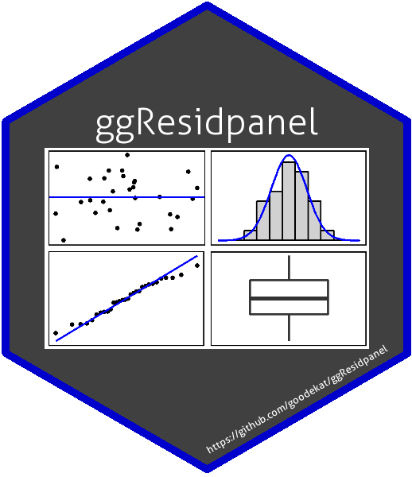

```{r setup, include = FALSE}
knitr::opts_chunk$set(echo = TRUE, warning = FALSE, message = FALSE)
```

# ggResidpanel 

ggResidpanel is an R package for creating panels of diagnostic plots for a model using ggplot2 and interactive versions of the plots using plotly.

## Installation

Follow these instructions to install ggResidpanel from the GitHub repository. (ggResidpanel is not currently available on CRAN.)

Install ggResidpanel from the GitHub repository using the devtools package.

```{r, eval = FALSE}
devtools::install_github("goodekat/ggResidpanel")
```

Load the ggResidpanel library.

```{r}
# Load the library
library(ggResidpanel)
```

## Overview and Examples

The package provides five functions that allow the user to assess diagnostic plots from a model. These functions are:

- `resid_panel`: Creates a panel of diagnostic plots of the residuals from a model
- `resid_interact`: Creates an interactive panel of diagnostic plots of the residuals form a model
- `resid_xpanel`: Creates a panel of diagnostic plots of the predictor variables 
- `resid_compare`: Creates a panel of diagnostic plots from multiple models
- `resid_auxpanel`: Creates a panel of diagnostic plots for model types not included in the package

Currently, ggResidpanel allows the first four functions listed above to work with models fit using the functions of `lm`, `glm`, `lme` (from nlme), and `lmer` or `glmer` (from lme4 or fit using lmerTest). Each of these functions is applied below to show the panel that is output from the function. The functions have multiple input options such as the formatting options of `scale`, `theme`, `axis.text.size`, `title.text.size`, and `title.opt`. See the documentation or vignettes for more details about how to use the functions.

#### `resid_panel`

This function creates a panel of residual diagnostic plots given a model of type "lm", "glm", "lmerMod", "lmerModLmerTest", and "glmerMod". It allows the user to select a panel of plots from the options in the package or create their own panel by selecting from the plots available for this function.

```{r}
# Fit a linear model
lm_model <- lm(Volume ~ Girth + Height, data = trees)

# Create the default panel of plots
resid_panel(lm_model, bins = 20)

# Create the R panel of plots and change the theme to classic
resid_panel(lm_model, bins = 20, plots = "R", theme = "classic")

# Create a panel with all plots available
resid_panel(lm_model, plots = "all", bins = 20)
```

#### `resid_interact`

This function creates interactive versions of residual diagnostic plot panels given a model. It accepts models of type "lm", "glm", "lmerMod", "lmerModLmerTest", and "glmerMod". Similar to `resid_panel`, it allows the user to select a panel of plots from the options in the package or to create their own panel by selecting from the plots available for this function.

```{r, eval = FALSE}
# Create an interactive panel of the default diagnostic plots
resid_interact(lm_model)
```


#### `resid_xpanel`

This function creates a panel of plots of the residuals or response variable versus the predictor (x) variables in the model. It accepts models of type "lm", "glm", "lmerMod", "lmerModLmerTest", and "glmerMod".

```{r}
# Create a panel of plots of the residuals versus the predictor variables
resid_xpanel(lm_model)

# Create a panel of plots of the response variable versus the predictor variables
resid_xpanel(lm_model, yvar = "response")
```

#### `resid_compare`

This function creates a panel of residual diagnostic plots given a list of models. This allows the user to compare the diagnostic plots from multiple models. It currently accepts models of type "lm", "glm", "lmerMod", "lmerModLmerTest", and "glmerMod".

```{r}
# Fit the model with a log transformation on the response variable
lm_model_log <- lm(log(Volume) ~ Girth + Height, data = trees)

# Plot the residual and normal quantile plots for the two models
resid_compare(list(lm_model, lm_model_log), plots = c("resid", "qq"))
```

#### `resid_auxpanel`

This function creates a panel of residual diagnostic plots given inputs of residuals and fitted values to use for models not accepted by `resid_panel`. Users can select from panel options in the package or create their own panel from the plots available for this function.

```{r}
# Fit a random forest model to the mtcars data to predict the mpg
rf_model <- randomForest::randomForest(x = mtcars[,2:11], y = mtcars[,1])

# Obtain the predictions from the model on the observed data
rf_pred <- predict(rf_model, mtcars[,2:11])

# Obtain the residuals from the model
rf_resid <- mtcars[,1] - rf_pred

# Create a panel with the residual and index plot
resid_auxpanel(rf_resid, rf_pred, plots = c("resid", "index"))
```

