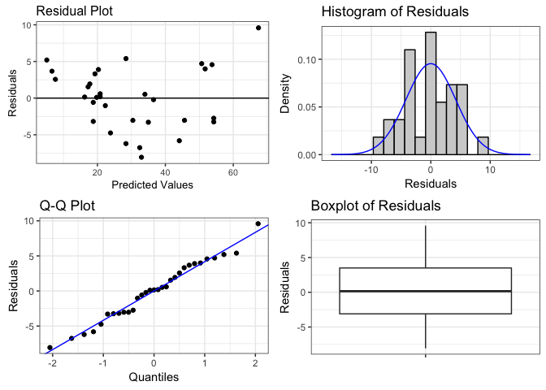

ggResidpanel
============

ggResidualpanel is an R package for creating a panel of diagnostic plots for residuals from a model using ggplot2.

Installation
------------

Follow these instructions to install ggResidualpanel.

Install the package devtools (if not already installed).

``` r
install.packages("tidyverse")
```

Load the devtools library.

``` r
library(devtools)
```

Install ggResidpanel from the GitHub repository.

``` r
devtools::install_github("goodekat/ggResidpanel")
```

Example
-------

``` r
library(ggResidpanel)

model <- lm(Volume ~ Girth, data = trees)

resid_panel(model$residuals, model$fitted.values, bins = 20)
```


