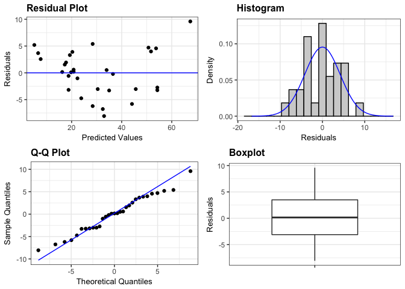

ggResidpanel
============

ggResidpanel is an R package for creating panels of diagnostic plots for residuals from a model using ggplot2 and interactive versions of the plots using plotly.

Functions
---------

<span style="color:blue">**resid\_panel**</span>: This function creates a panel of residual diagnostic plots given a model. It accepts models of type "lm", "glm", "lmerMod", and "glmerMod". `resid_panel` allows the user to select a panel of plots from the options in the package ("SAS", "R", "all"") or create their own panel by selecting from the plots available for this function ("boxplot", "cookd", "hist", "ls", "qq", "lev", "resid", "yvp"). Note that "cookd", "ls", and "lev" are not available for "lmer" and "glmer" models.

<span style="color:blue">**resid\_auxpanel**</span>: This function creates a panel of residual diagnostic plots given inputs of residuals and fitted values. This is meant to be used for models fit using methods other than those accepted by `resid_panel`. Users can select the "SAS" panel option or create their own panel from the plots available for this function ("boxplot", "hist", "qq", "resid").

<span style="color:blue">**resid\_interact**</span>: This function creates interactive versions of residual diagnostic plots given a model. It accepts models of type "lm", "glm", "lmerMod", and "glmerMod". `resid_interact` allows the user to select one plot to make interactive from the plots available for this function ("boxplot", "cookd", "hist", "ls", "qq", "lev", "resid", "yvp"). Note that "cookd", "ls", and "lev" are not available for "lmer" and "glmer" models.

Plots
-----

Below are the descriptions of the plots currently available in the package.

-   "boxplot": A boxplot of residuals
-   "cookd": A plot of Cook's D values versus observation numbers
-   "hist": A histogram of residuals (optional number of bins)
-   "ls": A location-scale plot of residuals
-   "qq": A normal quantile plot of residuals (optional confidence bands)
-   "lev": A plot of leverage values versus residuals
-   "resid": A plot of residuals versus predicted values (optional smoother)
-   "yvp": A plot of observed response values versus predicted values

Installation
------------

Follow these instructions to install ggResidualpanel.

Install the package devtools (if not already installed).

``` r
install.packages("tidyverse")
```

Load the devtools library.

``` r
library(devtools)
```

Install ggResidpanel from the GitHub repository.

``` r
devtools::install_github("goodekat/ggResidpanel")
```

Example
-------

``` r
library(ggResidpanel)

model <- lm(Volume ~ Girth, data = trees)

resid_panel(model, bins = 20)
```


