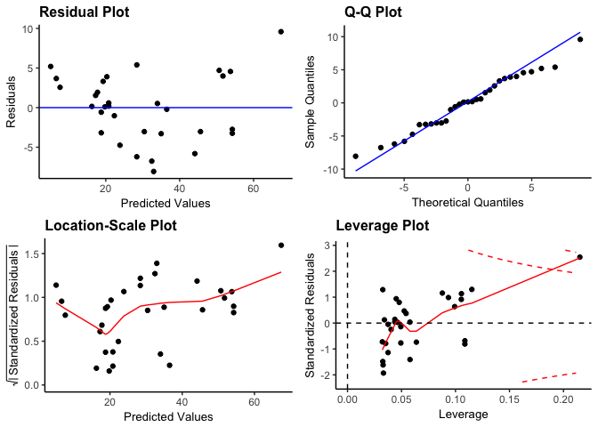
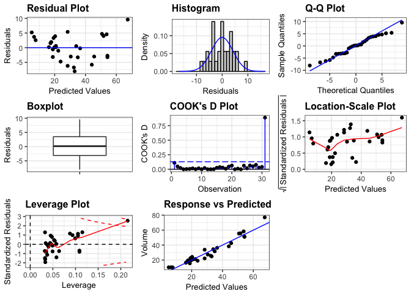
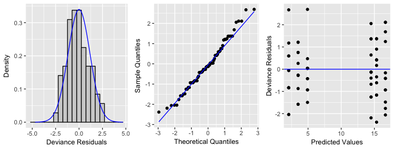

ggResidpanel
============

ggResidpanel is an R package for creating panels of diagnostic plots for residuals from a model using ggplot2 and interactive versions of the plots using plotly.

Overview
--------

The package provides three functions that allow the user to assess diagnostic plots of residuals from a model.

**`resid_panel`** This function creates a panel of residual diagnostic plots given a model of type "lm", "glm", "lmerMod", and "glmerMod". It allows the user to select a panel of plots from the options in the package or create their own panel by selecting from the plots available for this function.

**`resid_auxpanel`**: This function creates a panel of residual diagnostic plots given inputs of residuals and fitted values to use for models not accepted by `resid_panel`. Users can select the "SAS" panel option or create their own panel from the plots available for this function.

**`resid_interact`**: This function creates interactive versions of residual diagnostic plots given a model. It accepts models of type "lm", "glm", "lmerMod", and "glmerMod". It allows the user to select one plot to make interactive from the plots available for this function.

Below are the descriptions of the plots currently available.

-   `"boxplot"`: A boxplot of residuals
-   `"cookd"`: A plot of Cook's D values versus observation numbers
-   `"hist"`: A histogram of residuals (optional number of bins)
-   `"ls"`: A location-scale plot of residuals
-   `"qq"`: A normal quantile plot of residuals (optional confidence bands)
-   `"lev"`: A plot of leverage values versus residuals
-   `"resid"`: A plot of residuals versus predicted values (optional smoother)
-   `"yvp"`: A plot of observed response values versus predicted values

Note that not all plots are available for all model types. The package allows for the formatting options of `scale`, `theme`, `axis.text.size`, `title.text.size`, `title.opt`. See the documentation for more details.

Installation
------------

Follow these instructions to install ggResidualpanel.

Install the package devtools (if not already installed).

``` r
install.packages("tidyverse")
```

Load the devtools library.

``` r
library(devtools)
```

Install ggResidpanel from the GitHub repository.

``` r
devtools::install_github("goodekat/ggResidpanel")
```

Examples
--------

``` r
# Load the library
library(ggResidpanel)

# Fit a linear model
lm_model <- lm(Volume ~ Girth, data = trees)

# Create the default panel of plots
resid_panel(lm_model, bins = 20)
```


``` r
# Create the R panel of plots and change the theme to classic
resid_panel(lm_model, bins = 20, plots = "R", theme = "classic")
```



``` r
# Create a panel with all plots available
resid_panel(lm_model, plots = "all", bins = 20)
```



``` r
# Fit a glme model using a Poisson family
glm_model <- glm(count ~ spray, family = "poisson", data = InsectSprays)

# Specify three plots to use, request no title, change the theme to gray, and 
# indicate three columns
resid_panel(glm_model, plots = c("resid", "qq", "hist"), bins = 20, 
            title.opt = FALSE, theme = "gray", ind.ncol = 3)
```



``` r
# Create an interactive plot
resid_interact(lm_model, plot = "qq")
```

<!--html_preserve-->

<script type="application/json" data-for="20dc1f3de9f9">{"x":{"data":[{"x":[-8.80576288568714,-6.82968532436761,-5.76062007097865,-4.98124056805031,-4.34865829406571,-3.80510524717301,-3.32104482426034,-2.87914899160006,-2.46825921367301,-2.08067238189567,-1.71076407577058,-1.35422383075955,-1.00759788851534,-0.667997289527217,-0.332898968682799,3.03716505350456e-16,0.332898968682799,0.667997289527218,1.00759788851534,1.35422383075955,1.71076407577058,2.08067238189567,2.46825921367301,2.87914899160006,3.32104482426034,3.80510524717301,4.34865829406571,4.98124056805031,5.76062007097865,6.82968532436761,8.80576288568714],"y":[-8.06535951066543,-6.75877386838105,-6.20608873010604,-5.81024364092172,-4.74681794954665,-3.29170207980293,-3.24195648660925,-3.18096152670288,-3.03243129924355,-3.03000056777485,-2.74195648660925,-1.02706102269351,-0.580961526702881,-0.21145900665607,0.105867188728367,0.151966684719002,0.19269590415961,0.521469204765816,0.592695904159609,1.53879540015025,1.93220975786587,2.5639226035534,3.31245283101275,3.67709388812218,3.89928154644399,3.99097172481263,4.56462915567513,4.70414300938138,5.19685081497521,5.39391126989396,9.58681681399695],"text":["theoretical: -8.805763e+00<br />sample: -8.0653595<br />Residual: -8.0653595","theoretical: -6.829685e+00<br />sample: -6.7587739<br />Residual: -6.7587739","theoretical: -5.760620e+00<br />sample: -6.2060887<br />Residual: -6.2060887","theoretical: -4.981241e+00<br />sample: -5.8102436<br />Residual: -5.8102436","theoretical: -4.348658e+00<br />sample: -4.7468179<br />Residual: -4.7468179","theoretical: -3.805105e+00<br />sample: -3.2917021<br />Residual: -3.2917021","theoretical: -3.321045e+00<br />sample: -3.2419565<br />Residual: -3.2419565","theoretical: -2.879149e+00<br />sample: -3.1809615<br />Residual: -3.1809615","theoretical: -2.468259e+00<br />sample: -3.0324313<br />Residual: -3.0324313","theoretical: -2.080672e+00<br />sample: -3.0300006<br />Residual: -3.0300006","theoretical: -1.710764e+00<br />sample: -2.7419565<br />Residual: -2.7419565","theoretical: -1.354224e+00<br />sample: -1.0270610<br />Residual: -1.0270610","theoretical: -1.007598e+00<br />sample: -0.5809615<br />Residual: -0.5809615","theoretical: -6.679973e-01<br />sample: -0.2114590<br />Residual: -0.2114590","theoretical: -3.328990e-01<br />sample:  0.1058672<br />Residual:  0.1058672","theoretical:  3.037165e-16<br />sample:  0.1519667<br />Residual:  0.1519667","theoretical:  3.328990e-01<br />sample:  0.1926959<br />Residual:  0.1926959","theoretical:  6.679973e-01<br />sample:  0.5214692<br />Residual:  0.5214692","theoretical:  1.007598e+00<br />sample:  0.5926959<br />Residual:  0.5926959","theoretical:  1.354224e+00<br />sample:  1.5387954<br />Residual:  1.5387954","theoretical:  1.710764e+00<br />sample:  1.9322098<br />Residual:  1.9322098","theoretical:  2.080672e+00<br />sample:  2.5639226<br />Residual:  2.5639226","theoretical:  2.468259e+00<br />sample:  3.3124528<br />Residual:  3.3124528","theoretical:  2.879149e+00<br />sample:  3.6770939<br />Residual:  3.6770939","theoretical:  3.321045e+00<br />sample:  3.8992815<br />Residual:  3.8992815","theoretical:  3.805105e+00<br />sample:  3.9909717<br />Residual:  3.9909717","theoretical:  4.348658e+00<br />sample:  4.5646292<br />Residual:  4.5646292","theoretical:  4.981241e+00<br />sample:  4.7041430<br />Residual:  4.7041430","theoretical:  5.760620e+00<br />sample:  5.1968508<br />Residual:  5.1968508","theoretical:  6.829685e+00<br />sample:  5.3939113<br />Residual:  5.3939113","theoretical:  8.805763e+00<br />sample:  9.5868168<br />Residual:  9.5868168"],"type":"scatter","mode":"markers","marker":{"autocolorscale":false,"color":"rgba(0,0,0,1)","opacity":1,"size":5.66929133858268,"symbol":"circle","line":{"width":1.88976377952756,"color":"rgba(0,0,0,1)"}},"hoveron":"points","showlegend":false,"xaxis":"x","yaxis":"y","hoverinfo":"text","frame":null},{"x":[-8.80576288568714,8.80576288568714],"y":[-10.2842932348634,10.6723701814576],"text":["xline: -8.805763<br />yline: -10.28429","xline:  8.805763<br />yline:  10.67237"],"type":"scatter","mode":"lines","line":{"width":1.88976377952756,"color":"rgba(0,0,255,1)","dash":"solid"},"hoveron":"points","showlegend":false,"xaxis":"x","yaxis":"y","hoverinfo":"text","frame":null}],"layout":{"margin":{"t":42.1685346616853,"r":7.30593607305936,"b":38.854296388543,"l":41.7766708177667},"plot_bgcolor":"rgba(255,255,255,1)","paper_bgcolor":"rgba(255,255,255,1)","font":{"color":"rgba(0,0,0,1)","family":"","size":14.6118721461187},"title":"<b> Q-Q Plot <\/b>","titlefont":{"color":"rgba(0,0,0,1)","family":"","size":15.9402241594022},"xaxis":{"domain":[0,1],"type":"linear","autorange":false,"tickmode":"array","range":[-9.68633917425585,9.68633917425585],"ticktext":["-5","0","5"],"tickvals":[-5,0,5],"ticks":"outside","tickcolor":"rgba(51,51,51,1)","ticklen":3.65296803652968,"tickwidth":0.66417600664176,"showticklabels":true,"tickfont":{"color":"rgba(77,77,77,1)","family":"","size":11.689497716895},"tickangle":-0,"showline":false,"linecolor":null,"linewidth":0,"showgrid":true,"gridcolor":"rgba(235,235,235,1)","gridwidth":0.66417600664176,"zeroline":false,"anchor":"y","title":"Theoretical Quantiles","titlefont":{"color":"rgba(0,0,0,1)","family":"","size":13.2835201328352},"hoverformat":".2f"},"yaxis":{"domain":[0,1],"type":"linear","autorange":false,"tickmode":"array","range":[-11.3321264056794,11.7202033522736],"ticktext":["-10","-5","0","5","10"],"tickvals":[-10,-5,0,5,10],"ticks":"outside","tickcolor":"rgba(51,51,51,1)","ticklen":3.65296803652968,"tickwidth":0.66417600664176,"showticklabels":true,"tickfont":{"color":"rgba(77,77,77,1)","family":"","size":11.689497716895},"tickangle":-0,"showline":false,"linecolor":null,"linewidth":0,"showgrid":true,"gridcolor":"rgba(235,235,235,1)","gridwidth":0.66417600664176,"zeroline":false,"anchor":"x","title":"Sample Quantiles","titlefont":{"color":"rgba(0,0,0,1)","family":"","size":13.2835201328352},"hoverformat":".2f"},"shapes":[{"type":"rect","fillcolor":"transparent","line":{"color":"rgba(51,51,51,1)","width":0.66417600664176,"linetype":"solid"},"yref":"paper","xref":"paper","x0":0,"x1":1,"y0":0,"y1":1}],"showlegend":false,"legend":{"bgcolor":"rgba(255,255,255,1)","bordercolor":"transparent","borderwidth":1.88976377952756,"font":{"color":"rgba(0,0,0,1)","family":"","size":11.689497716895}},"hovermode":"closest"},"source":"A","attrs":{"20dcfab220":{"sample":{},"label":{},"type":"ggplotly"},"20dc4ac45360":{"sample":{},"label":{}}},"cur_data":"20dcfab220","visdat":{"20dcfab220":["function (y) ","x"],"20dc4ac45360":["function (y) ","x"]},"config":{"modeBarButtonsToAdd":[{"name":"Collaborate","icon":{"width":1000,"ascent":500,"descent":-50,"path":"M487 375c7-10 9-23 5-36l-79-259c-3-12-11-23-22-31-11-8-22-12-35-12l-263 0c-15 0-29 5-43 15-13 10-23 23-28 37-5 13-5 25-1 37 0 0 0 3 1 7 1 5 1 8 1 11 0 2 0 4-1 6 0 3-1 5-1 6 1 2 2 4 3 6 1 2 2 4 4 6 2 3 4 5 5 7 5 7 9 16 13 26 4 10 7 19 9 26 0 2 0 5 0 9-1 4-1 6 0 8 0 2 2 5 4 8 3 3 5 5 5 7 4 6 8 15 12 26 4 11 7 19 7 26 1 1 0 4 0 9-1 4-1 7 0 8 1 2 3 5 6 8 4 4 6 6 6 7 4 5 8 13 13 24 4 11 7 20 7 28 1 1 0 4 0 7-1 3-1 6-1 7 0 2 1 4 3 6 1 1 3 4 5 6 2 3 3 5 5 6 1 2 3 5 4 9 2 3 3 7 5 10 1 3 2 6 4 10 2 4 4 7 6 9 2 3 4 5 7 7 3 2 7 3 11 3 3 0 8 0 13-1l0-1c7 2 12 2 14 2l218 0c14 0 25-5 32-16 8-10 10-23 6-37l-79-259c-7-22-13-37-20-43-7-7-19-10-37-10l-248 0c-5 0-9-2-11-5-2-3-2-7 0-12 4-13 18-20 41-20l264 0c5 0 10 2 16 5 5 3 8 6 10 11l85 282c2 5 2 10 2 17 7-3 13-7 17-13z m-304 0c-1-3-1-5 0-7 1-1 3-2 6-2l174 0c2 0 4 1 7 2 2 2 4 4 5 7l6 18c0 3 0 5-1 7-1 1-3 2-6 2l-173 0c-3 0-5-1-8-2-2-2-4-4-4-7z m-24-73c-1-3-1-5 0-7 2-2 3-2 6-2l174 0c2 0 5 0 7 2 3 2 4 4 5 7l6 18c1 2 0 5-1 6-1 2-3 3-5 3l-174 0c-3 0-5-1-7-3-3-1-4-4-5-6z"},"click":"function(gd) { \n        // is this being viewed in RStudio?\n        if (location.search == '?viewer_pane=1') {\n          alert('To learn about plotly for collaboration, visit:\\n https://cpsievert.github.io/plotly_book/plot-ly-for-collaboration.html');\n        } else {\n          window.open('https://cpsievert.github.io/plotly_book/plot-ly-for-collaboration.html', '_blank');\n        }\n      }"}],"cloud":false},"highlight":{"on":"plotly_click","persistent":false,"dynamic":false,"selectize":false,"opacityDim":0.2,"selected":{"opacity":1}},"base_url":"https://plot.ly"},"evals":["config.modeBarButtonsToAdd.0.click"],"jsHooks":{"render":[{"code":"function(el, x) { var ctConfig = crosstalk.var('plotlyCrosstalkOpts').set({\"on\":\"plotly_click\",\"persistent\":false,\"dynamic\":false,\"selectize\":false,\"opacityDim\":0.2,\"selected\":{\"opacity\":1}}); }","data":null}]}}</script>
<!--/html_preserve-->
