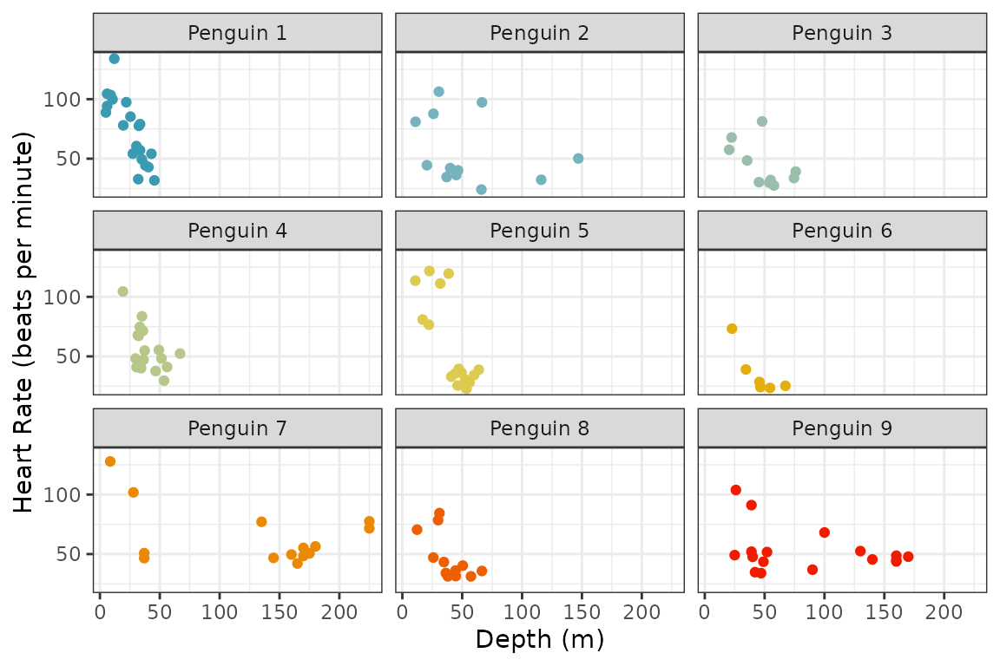
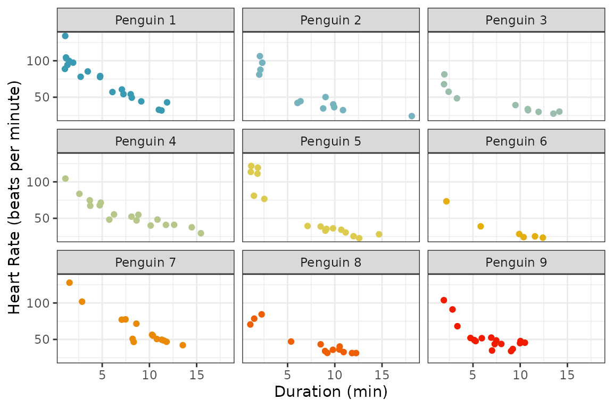
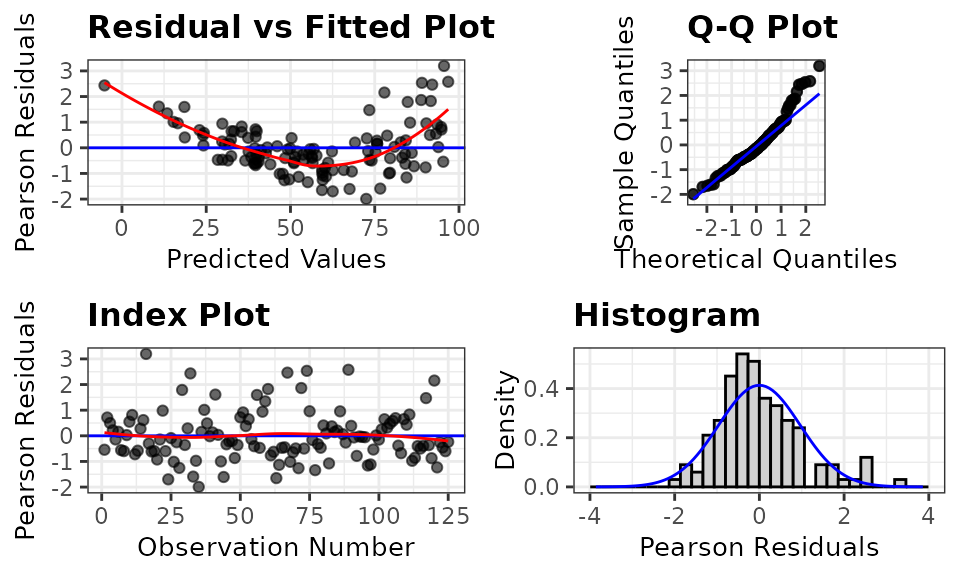
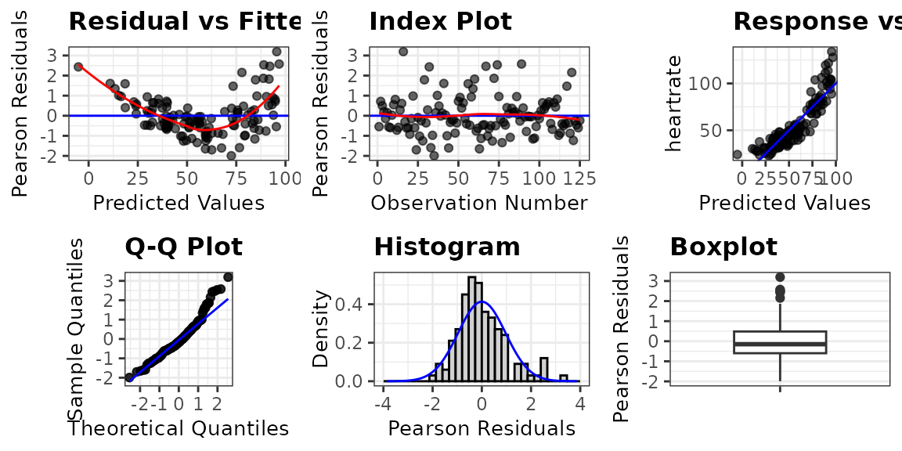
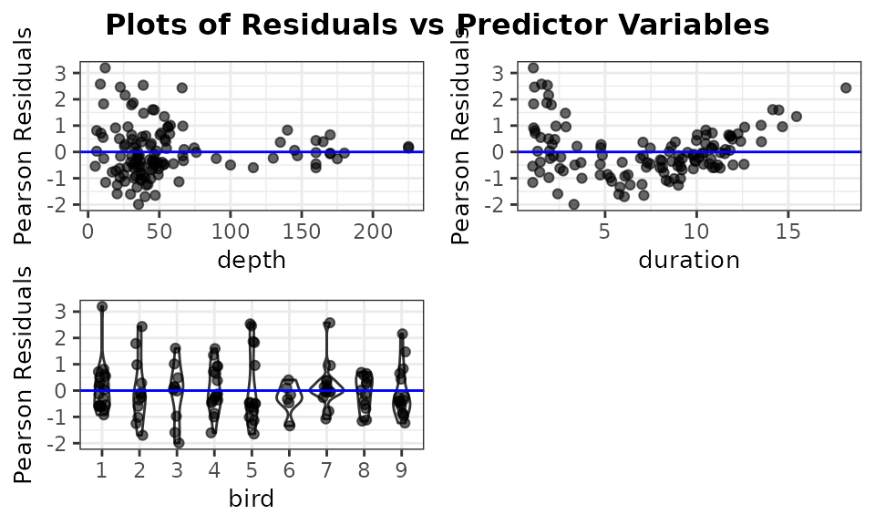
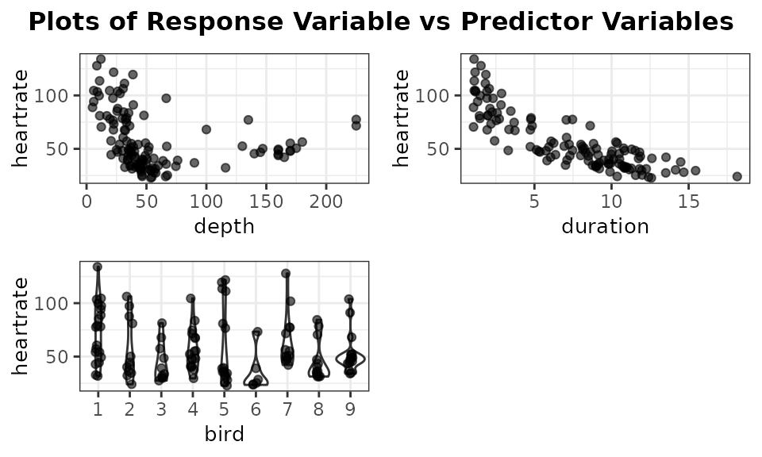
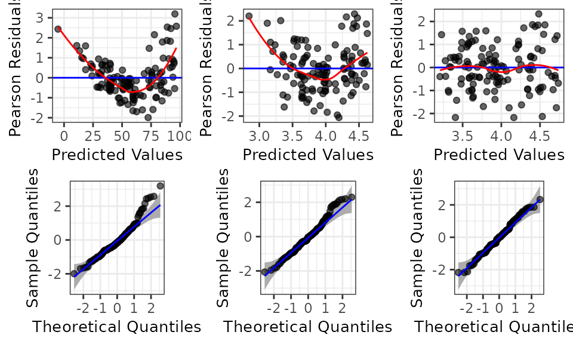
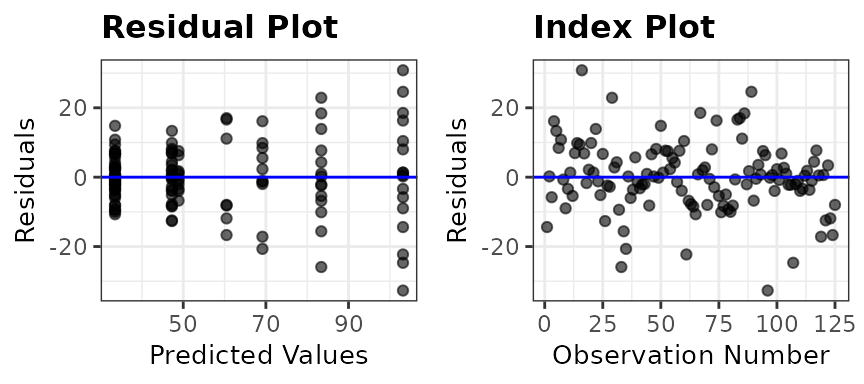
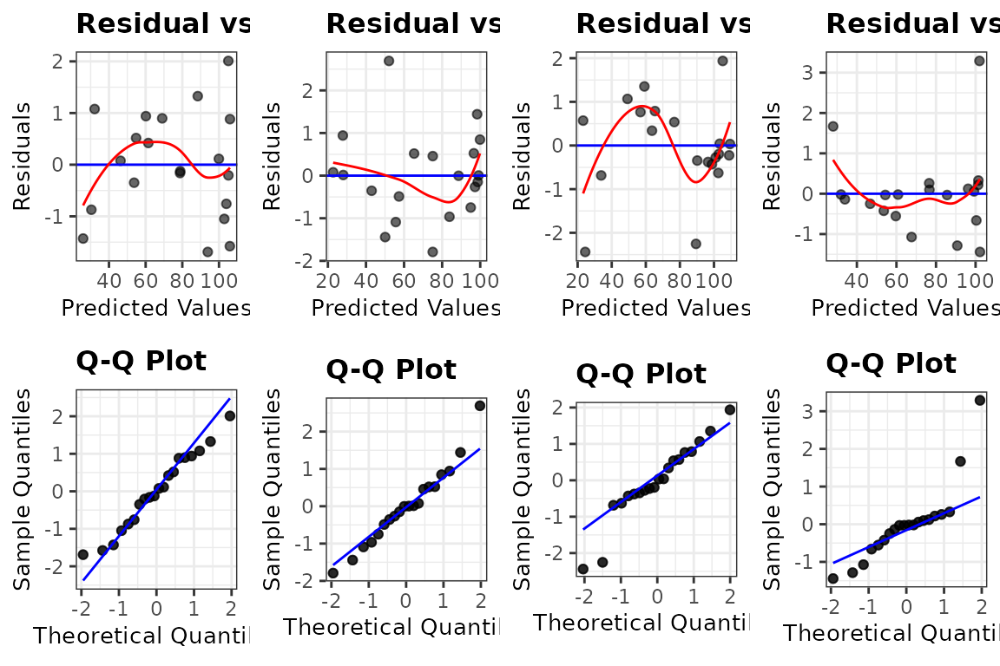

# An Introduction to ggResidpanel

ggResidpanel was developed with the intention of providing an easier way
to both create and view diagnostic plots for models in R. The graphics
are created using ggplot2, and interactive versions of the plots are
rendered using plotly. This vignette provides a brief introduction to
ggResidpanel with information on how to install the package, a
description of the functions included in the package, and examples. To
learn more about ggResidpanel, read through the [ggResidpanel Tutorial
and User
Manual](https://goodekat.github.io/ggResidpanel-tutorial/tutorial.html),
which contains the details for all of the functions in the package and
demonstrates how to use them.

## Functions

ggResidpanel functions:

- `resid_panel`: Creates a panel of diagnostic plots of the residuals
  from a model
- `resid_interact`: Creates an interactive panel of diagnostic plots of
  the residuals from a model
- `resid_xpanel`: Creates a panel of diagnostic plots of the predictor
  variables
- `resid_compare`: Creates a panel of diagnostic plots from multiple
  models
- `resid_auxpanel`: Creates a panel of diagnostic plots based on the
  predicted values and residuals from models not included in the package
- `resid_calibrate`: Creates a panel of diagnostic residual plots from a
  fitted model and simulated responses from the same model.

Currently, ggResidpanel allows the first four functions listed above to
work with models fit using the functions of `lm` and `glm` from base R,
`lme` from nlme, and `lmer` or `glmer` from lme4 (or fit using
lmerTest).

## Examples

``` r

library(dplyr)
library(ggplot2)
library(ggResidpanel)
```

Emperor penguins are able to dive under the water for long periods of
time. The dataset `penguins` included in ggResidpanel contains
information from a study done on the dives of emperor penguins. The
scientists who conducted the study were interested in understanding how
the heart rate of the penguins related to the depth and duration of the
dives. A device was attached to penguins that recorded the heart rate of
the bird during a dive.

The structure of the data are shown below. The data set has four
variables:

- heart rate of the penguin (beats per minute)
- depth of the dive (meters)
- duration of the dive (minutes)
- bird associated with the dive

There were 9 penguins included in the study with multiple observations
taken from each bird and a total of 125 observations in the dataset.

``` r

str(penguins)
#> 'data.frame':    125 obs. of  4 variables:
#>  $ heartrate: num  88.8 103.4 97.4 85.3 60.6 ...
#>  $ depth    : num  5 9 22 25.5 30.5 32.5 38 32 6 10.5 ...
#>  $ duration : num  1.05 1.18 1.92 3.47 7.08 ...
#>  $ bird     : Factor w/ 9 levels "1","2","3","4",..: 1 1 1 1 1 1 1 1 1 1 ...
```

The code below shows the number of observations per penguin. Penguin
number 6 has the least with only 6, and penguin number 1 has the most
with 20.

``` r

table(penguins$bird)
#> 
#>  1  2  3  4  5  6  7  8  9 
#> 20 12 10 17 16  6 14 13 17
```

The figure below shows scatter plots of heart rate versus depth of a
dive for each penguin. The points are colored by bird number. This data
shows a decrease in heart rate as the depth of the dive increases, but
the manner in which the heart rate decreases varies between penguins.



The next figure shows the heart rate versus duration of the dive for
each penguin. Again, there is a clear decrease in heart rate as the
duration of the dive increases. The trends are very similar between
penguins.



To model the data, a linear mixed effects model is fit below with heart
rate as the response variable. To start, depth and duration are included
as fixed main effects in the model, and a random effect for penguin is
specified.

``` r

library(lme4)
penguin_model <- lmer(heartrate ~ depth + duration + (1|bird), data = penguins)
```

The summary of the model is shown below.

``` r

summary(penguin_model)
#> Linear mixed model fit by REML ['lmerMod']
#> Formula: heartrate ~ depth + duration + (1 | bird)
#>    Data: penguins
#> 
#> REML criterion at convergence: 991.6
#> 
#> Scaled residuals: 
#>     Min      1Q  Median      3Q     Max 
#> -1.9927 -0.5966 -0.1473  0.4853  3.1947 
#> 
#> Random effects:
#>  Groups   Name        Variance Std.Dev.
#>  bird     (Intercept)  53.7     7.328  
#>  Residual             144.8    12.033  
#> Number of obs: 125, groups:  bird, 9
#> 
#> Fixed effects:
#>             Estimate Std. Error t value
#> (Intercept) 94.38863    3.47662  27.150
#> depth        0.05961    0.03260   1.828
#> duration    -5.72498    0.30836 -18.566
#> 
#> Correlation of Fixed Effects:
#>          (Intr) depth 
#> depth    -0.232       
#> duration -0.418 -0.459
```

### Diagnostic Panels with `resid_panel`

There are four key assumptions to check for this model.

1.  Independence of observations
2.  Linearity between the response variable and the predictor variables
3.  Constant variance of the residuals
4.  Normality of the residuals

The first assumption can only be checked by considering the study
design. In our case, there is a dependence between observations taken
from the same penguin, and we already accounted for this by including a
random effect for penguin in the model. The other assumptions can be
checked by looking at residual diagnostic plots. These plots can be
easily created by applying the function `resid_panel` from ggResidpanel
to the model. By default, a panel with four plots is created. This is
demonstrated below by applying `resid_panel` to the `penguin_model`. The
default panel includes the following four plots.

- **Residual Plot** (upper left): This is a plot of the residuals versus
  predictive values from the model to assess the linearity and constant
  variance assumptions. The curving trend seen in the `penguin_model`
  plot suggests a violation of the linearity assumption, and there
  appears to be a violation of the constant variance assumption as well
  since the variance of the residuals is getting larger as the predicted
  values increase.

- **Normal Quantile Plot** (upper right): Also known as a qq-plot, this
  plot allows us to assess the normality assumption. There appears to be
  a deviation from normality in the upper end of the residuals from the
  `penguin_model`, but this is not as much of a concern as linearity and
  constant variance issues.

- **Histogram** (lower right): This is a histogram of the residuals with
  a overlaid normal density curve with mean and standard deviation
  computed from the residuals. It provides an additional way to check
  the normality assumption. This plot makes it clear that there is a
  slight right skew in the residuals from the `penguin_model`.

- **Index Plot** (lower left): This is a plot of the residuals versus
  the observation numbers. It can help to find patterns related to the
  way that the data has been ordered, which may provide insights into
  additional trends in the data that have not been accounted for in the
  model. There is no obvious trend in the `penguin_model` index plot.

``` r

resid_panel(penguin_model)
```



All functions in the package include a `plots` option that allows users
to specify which plots to include in the panel. Users can either specify
an individual plot, a vector of plot names, or a prespecified panel.

**Plot Names**:

- `"boxplot"`: A boxplot of residuals
- `"cookd"`: A plot of Cook’s D values versus observation numbers
- `"hist"`: A histogram of residuals
- `"index"`: A plot of residuals versus observation numbers
- `"ls"`: A location scale plot of the residuals
- `"qq"`: A normal quantile plot of residuals
- `"lev"`: A plot of standardized residuals versus leverage values
- `"resid"`: A plot of residuals versus predicted values
- `"yvp"`:: A plot of observed response values versus predicted values

Note that the plots of “cookd”, “ls”, and “lev” are only available for
models fit using `lm` and `glm` and cannot be selected with
`resid_auxpanel`.

**Prespecified Panels**:

- `"all"`: panel of all plots in the package that are available for the
  model type
- `"default"`: panel with a residual plot, a normal quantile plot of the
  residuals, an index plot of the residuals, and a histogram of the
  residuals
- `"R"`: panel with a residual plot, a normal quantile plot of the
  residuals, a location-scale plot, and a residuals versus leverage plot
  (modeled after the plots shown in R if the `plot` function is applied
  to an lm model)
- `"SAS"`: panel with a residual plot, a normal quantile plot of the
  residuals, a histogram of the residuals, and a boxplot of the
  residuals (modeled after the residpanel option in proc mixed from SAS)

Note that the `"R"` option can only be used with models fit using `lm`
and `glm`.

Here is an example requesting a panel with all plots available for a
model fit using `lmer`.

``` r

resid_panel(penguin_model, plots = "all")
```



### Interactivity with `resid_interact`

The static panel of plots does not allow one to easily identify an
observation associated with a point of interest. The function
`resid_interact` allows users to interact with the plots thanks to
plotly. The code below creates a panel with a residual plot and qq-plot
with interactivity. When the cursor is hovered over a point, a tooltip
appears with the x and y location of the point, the observed values from
variables included in the model associated with the point, and the
observation number. This function is meant to help users identify
outliers and points of interest in the plot.

``` r

resid_interact(penguin_model, plots = c("resid", "qq"))
#> Warning: The following aesthetics were dropped during statistical transformation: label.
#> ℹ This can happen when ggplot fails to infer the correct grouping structure in
#>   the data.
#> ℹ Did you forget to specify a `group` aesthetic or to convert a numerical
#>   variable into a factor?
#> The following aesthetics were dropped during statistical transformation: label.
#> ℹ This can happen when ggplot fails to infer the correct grouping structure in
#>   the data.
#> ℹ Did you forget to specify a `group` aesthetic or to convert a numerical
#>   variable into a factor?
```

### Incorporating Predictor Variables with `resid_xpanel`

To further assess the issues with a model, it may be helpful to look at
plots of the residuals versus the predictor variables. This can be done
easily by applying the function `resid_xpanel` to the model.

The code below creates a panel with a plot included for each predictor
variable in the `penguin_model`. That is, three plots are created for
the variables of depth, duration, and bird. Pearson residuals are
plotted on the y-axis for each of the plots. These plots show a clear
decrease in variation of the residuals as the value of depth increases,
and the nonlinear relationship appears to be related to the variable of
duration. The plot of residuals versus bird shows no obvious trend and
relatively constant variance across the penguins.

``` r

resid_xpanel(penguin_model, jitter.width = 0.1)
```



The function `resid_xpanel` has the option to plot the response variable
on the y-axis by setting `yvar = "response"`. The updated code and
resulting panel of plots is shown below. The plot of heart rate versus
duration suggests that including a quadratic term for duration may help
improve the model fit.

``` r

resid_xpanel(penguin_model, yvar = "response", jitter.width = 0.1)
```



### Model Comparisons with `resid_compare`

To deal with the violations of the model assumptions in the
`penguin_model`, two new models are fit. The first (`penguin_model_log`)
uses a log transformation of the heart rate as the response, and the
second model `penguin_model_log2` uses both a log transformation of the
response and a quadratic term for duration.

``` r

penguin_model_log <- 
  lmer(
    log(heartrate) ~ depth + duration + (1|bird), 
    data = penguins
  )
penguin_model_log2 <- 
  lmer(
    log(heartrate) ~ depth + duration + I(duration^2) + (1|bird), 
    data = penguins
  )
```

The function `resid_compare` allows the residual plots from multiple
models to be compared side by side. The first argument in
`resid_compare` is a list of the models to compare. In the code below,
the models fit to the `penguin` data are included in the list, and the
`resid`, and `qq` plots are selected to be included in the panel to
assess the linearity, constant variance, and normality assumptions. Some
additional options have also been specified, which are available in
other functions of the package as well. The option of `smoother = TRUE`
adds a smoother to the residual plots, and `qqbands = TRUE` adds a 95%
confidence interval to the qq-plot. The option of `title.opt = FALSE`
removes the titles from the plots. The resulting panel includes plots
where each column contains the plots associated with one of the models.
The plots are ordered from left to right following the order the models
were specified in the list.

The log transformed model still shows some curvature in the residual
plot and skewness in the normal quantile plot. However, the model with
both the log transformation and a quadratic term for duration appears to
meet all of the assumptions.

``` r

resid_compare(
  models = list(penguin_model, penguin_model_log, penguin_model_log2),
  plots = c("resid", "qq"),
  smoother = TRUE,
  qqbands = TRUE,
  title.opt = FALSE
)
```



### Additional Model Types with `resid_auxpanel`

The function `resid_auxpanel` has been included in the package to allow
for the creation of diagnostic plot panels with models that are not
included in the package. For example, if there was a desire to try
fitting a regression tree to the `penguins` data, it would not be
possible to create residual plots with any of the ggResidpanel functions
considered so far.

A regression tree is fit to the `penguins` data below using the rpart
package.

``` r

penguin_tree <- rpart::rpart(heartrate ~ depth + duration, data = penguins)
```

We can extract the predicted values from the regression tree and use
these to compute the residuals for the model.

``` r

penguin_tree_pred <- predict(penguin_tree)
penguin_tree_resid <- penguins$heartrate - penguin_tree_pred
```

The function `resid_auxpanel` accepts the residuals and predicted values
as inputs and uses these to create diagnostic plots. Since some of the
plots available in the package require additional information from a
model (`cookd`, `lev`, and `ls`), they cannot be used with
`resid_auxpanel` as previously mentioned.

The code below takes the residuals and predicted values from
`penguin_tree` and creates a panel with a `resid` and `index` plot. The
residual plot shows an increase in variance, and it may be of interest
to adjust for this in some way with the model. The index plot does not
show any concerns.

``` r

resid_auxpanel(
  residuals = penguin_tree_resid, 
  predicted = penguin_tree_pred, 
  plots = c("resid", "index")
)
```



### Visual Check for Trends with `resid_calibrate`

The function `resid_calibrate` creates a panel of diagnostic residual
plots from a fitted model and simulated responses from the same model.
This is used to calibrate expectations for simulation variability when
assumptions are true (see ), to compare to the actual observed residuals
in any of a suite of diagnostic plots. This function requires the fitted
model and the data set. However, for now, it only works with `lm`
models.

``` r

# Fit an example model with one of the penguins
penguin1_model <- 
  lm(
    heartrate ~ depth + duration,
    data = penguins |> dplyr::filter(bird == 1)
  )

# Create panel of simulated and real plots
resid_calibrate(
  model = penguin1_model, 
  plots = c("resid", "qq"), 
  nsim = 3, 
  shuffle = TRUE, 
  identify = TRUE
)
#> [1] "Real residuals are in column 4"
```


