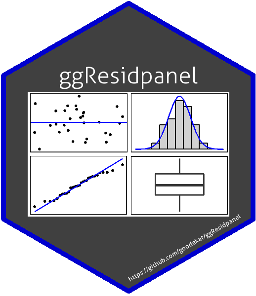

```{r setup, include = FALSE}
knitr::opts_chunk$set(echo = TRUE, fig.align = 'center', cache = TRUE)
```

{width=25%}

# Introduction to ggResidpanel

ggResidpanel provides a way to easily create and view diagnostic plots from models in R using ggplot2 graphics. The goal in creating the package was to allow a model to be passed to a function that returns a panel of diagnostic plots that can be viewed simultaneously. The panel allows the user to scan plots of interest to check for violations of model assumptions or lack of fit. The idea to portray the plots in a grid was motivated by the residual panel plots provided in [SAS procedures](https://support.sas.com/documentation/cdl/en/statug/63962/HTML/default/viewer.htm#statug_mixed_sect030.htm). In addition to being able to view plots in a panel, ggResidpanel allows for the creation of panels with interactive plots and the ability to view plots from multiple models in the same panel. These operations can be obtained by applying one of the four functions listed below to a model. 

- [`resid_panel`](#resid_panel): Creates a panel of diagnostic plots of the residuals from a model
- [`resid_interact`](#resid_interact): Creates an interactive panel of diagnostic plots of the residuals form a model
- [`resid_xpanel`](#resid_xpanel): Creates a panel of diagnostic plots of the predictor variables 
- [`resid_compare`](#resid_compare): Creates a panel of diagnostic plots from multiple models

As of now, ggResidpanel allows these functions to work with models of type "lm", "glm", "lme", "lmer", "glmer", and "lmerTest". An additional function is included in the package that can be used with any model type and produces similar output as `resid_panel`.

- [`resid_auxpanel`](#resid_auxpanel): Creates a panel of diagnostic plots for model types not included in the package

All functions in the package include the ability to select which plots to include in the panel, ways to to adjust plot characteristics, and options to change the figure format. Each function has a section in this vignette with details on how to use the function and examples. 

## Installation

The package is currently only available on GitHub. The intention is to add the package to CRAN in the near future. For now, the following code can be used to install ggResidpanel using the devtools package.

```{r eval = FALSE}
# Downloads and installs ggResidpanel from GitHub
devtools::install_github("goodekat/ggResidpanel")
```

To use the package in R, load the library into your R session with the following code.

```{r}
# Loads the library
library(ggResidpanel)
```

## Example Data

The functions in this vignette will be demonstrated by using the `trees` data included in base R. The dataset contains information on the volume, girth, and height of 31 black cherry trees. The first six rows of the data are shown below.

```{r}
head(trees)
```

A linear model is fit below to determine if there is a linear relationship between the volume of the tree and its height and girth. This model will be used for examples throughout this vignette.

```{r}
# Fits a linear model with a response variable of volume and predictor
# variables of height and girth
tree_model <- lm(Volume ~ Height + Girth, data = trees)
```

# `resid_panel` {#resid_panel}

## Overview

The function `resid_panel` is applied to a model and returns a panel of diagnostic plots. It currently accepts the following models.

  - "lm": models fit using the function [`lm`](https://stat.ethz.ch/R-manual/R-patched/library/stats/html/lm.html) from base R
  - "glm": models fit using the function [`glm`](https://stat.ethz.ch/R-manual/R-patched/library/stats/html/glm.html) from base R
  - "lmer", "glmer", and "lmerTest": models fit using the [`lmer`](https://www.rdocumentation.org/packages/lme4/versions/0.999375-37/topics/lmer) or [`glmer`](https://www.rdocumentation.org/packages/lme4/versions/1.1-21/topics/glmer) functions from either the lme4 package or fit with the lmerTest package loaded
  - "lme": models fit using the [`lme`](https://www.rdocumentation.org/packages/nlme/versions/3.1-137/topics/lme) function from the `nlme` package

The first argument in `resid_panel` is the `model` option. The most basic use of `resid_panel` is to only include the model in the function. The code below shows the figure that is created if the `tree_model` is input into `resid_panel` with no other options specified. This produces a panel with the four plots of a residual plot, a normal quantile plot, an index plot, and a histogram of the residuals.

```{r}
# Creates the default panel of plots based on the tree_model
resid_panel(tree_model)
```

## Plots {#plots}

The `plots` option in `resid_panel` allows the user to select the designed plots to include in the panel. There are three ways a user can do this.

1. Specify an [individual plot](#individual) to create one plot
2. Specify a [vector of plots](#vector) included in the package to create a panel including these plots
3. Specify the name of a [prespecified panel](#prespecified) of plot included in the package

Explanations and examples for each of these methods are included in the next three sections.

### Individual Plots {#individual}

An individual plot can be created by including the option of `plots = "name of plot"` in the `resid_panel` function. The name of the plot must be in quotations. There are currently nine plots included in the package with `resid_panel`. Their names in the packages are as follows.

- [`boxplot`](#boxplot)
- [`cookd`](#cookd)
- [`hist`](#hist)
- [`index`](#index)
- [`lev`](#lev)
- [`ls`](#ls)
- [`qq`](#qq)
- [`resid`](#resid)
- [`yvp`](#yvp)

All plots are available to be used with "lm" and "glm" models, but `cookd`, `lev`, and `ls` are not available to be used with "lmer", "glmer", "lmerTest", and "lme" models. The details and examples of each plot are included below.

#### `boxplot`: Boxplot of the Residuals {#boxplot}

The option of `plots = "boxplot"` creates a boxplot of the residuals. 

This can be used to visualize the distribution of the residuals from the model. It may help to identify outliers or determine if the distribution of the residuals is skewed.

```{r}
# Creates a boxplot of the residuals
resid_panel(tree_model, plots = "boxplot")
```

#### `cookd`: Cook's Distance Plot {#cookd}

The option of `plots = "cookd"` creates a plot of the Cook's distance values versus the observation numbers. It is only available for "lm" and "glm" models. The blue dashed horizontal line is placed at 4/n where n is the number of observations used to fit the model.

This plot can be used to check for points with high leverage. Points above the dashed blue line are considered to be high leverage points, and points that have Cook's D values that are much larger than the rest are of particular interest.

```{r}
# Creates a Cook's D plot
resid_panel(tree_model, plots = "cookd")
```

#### `hist`: Histogram of the Residuals {#hist}

The option of `plots = "hist"` creates a histogram of the residuals. The blue line is a normal density curve with a mean of zero and a standard deviation equal to the standard deviation of the residuals. 

`resid_panel` includes a `bins` option to specify the number of bins in the histogram. By default, `bins = 30` is based on the default for the number of bins in the ggplot2 [`geom_histogram`](https://ggplot2.tidyverse.org/reference/geom_histogram.html) function.

This is another plot that can be used to visualize the distribution of the residuals. In particular, the normal density curve allows for the comparison of the residuals to a normal distribution.

```{r}
# Creates a histogram of the residuals
resid_panel(tree_model, plots = "hist")

# Creates a histogram with 20 bins
resid_panel(tree_model, plots = "hist", bins = 20)
```

#### `index`: Index Plot of the Residuals {#index}

The option of `plots = "index"` creates a plot of the residuals versus the observation numbers. A solid blue horizontal line through 0 is included for reference.

`residual_panel` includes a `smoother` indicator option. If set to `TRUE`, a loess smoother will included on the index plot as a red solid line. If set to `FALSE`, it will not be included. By default, `smoother = FALSE`. (This option also affects the `lev`, `ls`, and `resid` plots.)

This plot can be used to look for patterns in the residuals in regards to the manner in which the data used to fit the model have been ordered. Often the data are ordered in a meaningful way such as by time of observation. This plot can help to check if there is any relationship between the residuals and the order of the data. If a trend is found in this plot, it may suggest that a variable has been excluded from the model that would help to explain the variation in the response variable.

```{r}
# Creates an index plot of the residuals
resid_panel(tree_model, plots = "index")

# Creates an index plot with a smoother added
resid_panel(tree_model, plots = "index", smoother = TRUE)
```

#### `lev`: Residual-Leverage Plot {#lev}

The option of `plots = "lev"` creates a plot of the standardized residuals versus the leverage values. This plot is only available for "lm" and "glm" models. A horizontal line through 0 and a vertical line through 0 are included as black dashed lines to mimic the residual-leverage plot created by the [`plot.lm`](https://www.rdocumentation.org/packages/stats/versions/3.5.2/topics/plot.lm) function from base R. The red dashed lines are Cook's distance contour lines for Cook's D values of 0.5 and 1. These values were chosen based on the default options used in `plot.lm`. 

The `residual_panel` option of `smoother` affects the location-scale plot. If set to `TRUE`, a loess smoother will included on the residual-leverage plot as a red solid line. If set to `FALSE`, it will not be included. By default, `smoother = FALSE`. (This option also affects the `index`, `ls`, and `resid` plots.)

The Cook's D contour lines are computed using the fact that Cook's distance can be written as a function of the leverage and the standardized residual. For observation $i$, let $D_i$ represent the Cook's distance, $r_i$ represent the standardized residual, and $h_i$ represent the leverage value. Finally, let $p$ be the rank of the model. Cook's distance can be computed as
  $$D_i = \frac{r_i}{p}\left(\frac{h_i}{(1-h_i)^2}\right).$$
Thus, given a specified value of Cook's D, a leverage value ($h_i$), and the rank of the model ($p$), it is possible to solve for the value of the standardized residual ($r_i$). The value of $D_i=1$ is used since a data point with a value of Cook's D larger than 1 is often considered to be a point with high leverage.

This plot can be used to look for trends in the residuals based on the leverage values and to identify points with high leverage. Points that fall outside of the Cook's D contours lines may be of interest. Points that fall outside of the contour line with Cook's D set to 1 are considered to be high leverage points. As seen in the plot below, not all contour lines may appear when the plot is created if they fall far outside of the range of the observed leverage values.

```{r}
# Creates a residual-leverage plot
resid_panel(tree_model, plots = "lev")

# Creates a residual-leverage plot with a smoother added
resid_panel(tree_model, plots = "lev", smoother = TRUE)
```

#### `ls`: Location-Scale Plot {#ls}

The option of `plots = "ls"` creates a location-scale plot of the residuals. This plot is only available for "lm" and "glm" models. It plots the square root of the absolute value of the standardized residuals on the y-axis and the predicted values on the x-axis. The predicted values are plotted on the original scale for "glm" and "glmer" models. 

The `residual_panel` option of `smoother` affects the location-scale plot. If set to `TRUE`, a loess smoother will included on the location-scale plot as a red solid line. If set to `FALSE`, it will not be included. By default, `smoother = FALSE`. (This option also affects the `index`, `lev`, and `resid` plots.)

The location-scale plot can be used to check for patterns in the residuals in relationship to the predicted values. For example, homogeneity of the residuals can be diagnosed by determining whether the residuals show equal spread along the range of the predicted values. In the ideal situation, the loess curve would be a straight line with points evenly dispersed around it for the whole range of the predicted values.

```{r}
# Creates a location-scale plot of the residuals
resid_panel(tree_model, plots = "ls")

# Creates a location-scale plot of the residuals with a 
resid_panel(tree_model, plots = "ls", smoother = TRUE)
```

#### `qq`: Normal Quantile Plot {#qq}

The option of `plots = "qq"` creates a normal quantile plot of residuals using the R package [qqplotr](https://cran.r-project.org/web/packages/qqplotr/index.html). The sample quantiles are plotted on the y-axis, and the theoretical normal quantiles are plotted on the x-axis. See the qqplotr documentation for details on the computation of the sample and theoretical quantiles. The blue line is a 1-1 line shown for reference. 

`resid_panel` includes two options to adjust the normal quantile plot based on the qqplotr package. The option of `qqline` indicates whether to include the 1-1 line on the qq-plot. By default, `qqline = TRUE`. The option of `qqbands` indicates whether to include 95% confidence bands on the qq-plot. By default, `qqbands = FALSE`.

This plot is meant to be used to check if the residuals approximately follow a normal distribution. If the points follow the 1-1 line, it suggests that the residuals are approximately normally distributed.

```{r}
# Creates a normal quantile plot of the residuals
resid_panel(tree_model, plots = "qq")

# Creates a qq-plot with the 1-1 line removed
resid_panel(tree_model, plots = "qq", qqline = FALSE)

# Creates a qq-plot with the confidence bands added
resid_panel(tree_model, plots = "qq", qqbands = TRUE)
```

#### `resid`: Residual Plot {#resid}

The option of `plots = "resid"` creates a plot of the residuals versus the predicted values. The predicted values are plotted on the original scale for "glm" and "glmer" models. A solid blue horizontal line through 0 is included for reference.

The `residual_panel` indicator option of `smoother` affects the residual plot. If set to `TRUE`, a loess smoother will included on the residual plot as a red solid line. If set to `FALSE`, it will not be included. By default, `smoother = FALSE`. (This option also affects the `index`, `lev`, and `ls` plots.)

The residual plot can be used to check for homogeneity (constant variance) of the residuals and possible violations of the linearity assumption. The assumption of homogeneity is met if the residuals are have approximately the same variance throughout the entire range of the predicted values. The assumption of linearity may be violated if there is some trend in the residuals so that the residuals are not evenly distributed below and above 0 throughout the range of the predicted values.

```{r}
# Creates a residual plot
resid_panel(tree_model, plots = "resid")

# Creates a plot with the smoother added
resid_panel(tree_model, plots = "resid", smoother = TRUE)
```

#### `yvp`: Response vs. Predicted Plot {#yvp}

The option of `plots = "yvp"` creates a plot of the observed response variable values versus the predicted values from the model. Both response variable and predicted values are plotted on the original scale for "glm" and "glmer" models. The blue solid line is a 1-1 line, which is included for reference.

This plot provides a visualization to assess how similar the model predictions of the response variable are in relationship to the observed response variable values. The model is producing predictions similar to the observed values if the points follow the 1-1 line.

```{r}
# Creates a plot of observed values vs. fitted values
resid_panel(tree_model, plots = "yvp")
```

### User Specified Panels {#vector}

The `plots` option in `resid_panel` also allows the user to specify a vector of plots to include in a panel. To do this, the user can include an option of the form of `plots = c("name of plot 1", "name of plot 2", ...))` in the function. The names of the plots must be in quotations. Any of the individual plots listed in the previous section that are available for the type of model being input to `resid_panel` can be included in the vector, and any number of plots greater than 0 can be included in the vector. Note that if a plot name is included multiple times in the vector, a plot will be created for each instance the name is included. Some examples of user specified panels are included below.

```{r}
# Creates a panel with a user specified vector of two plot names
resid_panel(tree_model, plots = c("resid", "qq"))

# Creates a panel from a vector of four plot names
resid_panel(tree_model, plots = c("hist", "ls", "cookd", "lev"))

# An example to show what happens if a plot name is included multiple times in the vector
resid_panel(tree_model, plots = c("resid", "resid"))
```

### Package Prespecified Panels {#prespecified}

ggResidpanel includes prespecified panel options for `resid_panel` that the authors of the package thought users would find helpful. These can be used by including the option of `plots = "specified panel name"` in `resid_panel`. The four package included panel option are as follows.

- [`all`](#all)
- [`default`](#default)
- [`R`](#R)
- [`SAS`](#SAS)

The options of `all`, `default`, and `SAS` can be used for all model types, but the option of `R` can only be used for models of type "lm" or "glm". The details of these panels and examples are included below.

#### `all`: Panel of All Plots {#all}

The option of `plots = "all"` creates a panel of all plots included in the package that are available for the type of model input into `resid_panel`. Note that "cookd", "ls", and "lev" are not available for "lmer", "lmerTest", "glmer", and "lme" models.

```{r}
# Creates a panel of all plots available for an "lm" model
resid_panel(tree_model, plots = "all")
```

#### `default`: Default Panel {#default}

Unsurprisingly, the option of `plots = "default"` is the default panel displayed when `resid_panel` is applied to a model with no `plots` option specified. This creates a panel with a residual plot, a normal quantile plot of the residuals, an index plot of the residuals, and a histogram of the residuals.

```{r}
# Creates the default panel of plots
resid_panel(tree_model)

# Creates the default panel with the option explicitly specified
resid_panel(tree_model, plots = "default")
```

#### `R`: Base R Inspired Panel of Plots {#R}

The option of `plots = "R"` is designed to mimic the diagnostic plots created by applying the base R function `plot` to an "lm" or "glm" model. As a result, it can only be used with an "lm" or "glm" model. It creates a panel with a residual plot, a normal quantile plot of the residuals, a location-scale plot, and a residual-leverage plot.

```{r}
# Creates the R panel of plots with the smoother option set to TRUE
resid_panel(tree_model, plots = "R", smoother = TRUE)

# These are the lm diagnostic plots from base R which the "R" panel is designed to mimic
par(mfrow = c(2,2)) # Creates a 2x2 grid of plots
plot(tree_model)    # Creates the base R diagnostic plots
par(mfrow = c(1,1)) # Returns the settings to a 1x1 grid of plots
```

#### `SAS`: SAS Inspired Panel of Plots {#SAS}

The option of `plots = "SAS"` creates a panel with a residual plot, a normal quantile plot of the residuals, a histogram of the residuals, and a boxplot of the residuals. This was modeled after the residpanel option in proc mixed from SAS.

```{r}
# Creates the SAS panel of plots
resid_panel(tree_model, plots = "SAS")
```

## Residual Types {#type}

The option of `type` in `resid_panel` allows for the selection of the type of residuals to use in the panel. Several residual types are available to be requested based on the model type that is input into `resid_panel`. These are listed below. If a `type` is not specified, the default residual type for each model type is used. If a type other than raw residuals are used, the axis label for the axis that the residuals are plotted on will specify the type of residual used. For example, if the raw residuals are used, the axis label will be "Residuals", but if Pearson residuals are used, the axis label will be "Pearson Residuals".

#### Options for Residual `type`

"lm" model residual options:

- `pearson`: Pearson residuals
- `response`: raw residuals (default for "lm")
- `standardized`: standardized raw residuals

"glm" model residual options:

- `pearson`: Pearson residuals
- `deviance`: deviance residuals (default for "glm")
- `response`: raw residuals
- `stand.deviance`: standardized deviance residuals
- `stand.pearson`: standardized Pearson residuals

"lmer", "lmerTest", and "lme" model residual options:

- `pearson`: Pearson residuals (default for "lmer" and "lmerTest")
- `response`: raw residuals

"glmer" model residual options:

- `pearson`: Pearson residuals
- `deviance`: deviance residuals (default for "glmer")
- `response`: raw residuals

Note that the plots of `ls` and `lev` only accept standardized residuals.

```{r}
# Example requesting standardized residuals with a panel of plots from an lm model
resid_panel(tree_model, type = "standardized")
```

## Formatting Options {#format}

All of the functions in ggResidpanel have the following options for adjusting the format of the panel.

- [`axis.text.size`](#text.size) and [`title.text.size`](#text.size)
- [`nrow`](#nrow)
- [`scale`](#scale)
- [`theme`](#theme)
- [`title.opt`](#title.opt)

The details of how to use these options and examples of displaying the changes are shown below.

#### `axis.text.size` and `title.text.size`: Plot Text Size {#text.size}

There are two options that can be used to adjust the text size in the panel. The option of `axis.text.size` specifies the size of the text for the axis labels. By default, `axis.text.size = 10`. The option of `title.text.size` specifies the size of the text for the titles. By default, `title.text.size = 12`. Both of these options adjust the text size in all of the plots in the panel.

```{r}
# Creates the default panel with larger text sizes for both the axis labels and the title
resid_panel(tree_model, axis.text.size = 14, title.text.size = 16)
```

#### `nrow`: Number of Rows in the Panel {#nrow}

The option of `nrow` allows the user to specify the number of rows in the panel. This works for both user and package prespecified panels.

```{r fig.width = 12, fig.height = 4}
# Creates the default panel of four plots with all of the plots in a row instead of a 2x2 grid
resid_panel(tree_model, nrow = 1)
```

```{r fig.width = 3, out.width = '40%'}
# Creates a panel with a residual plot and a qq-plot with two rows 
resid_panel(tree_model, plots = c("resid", "qq"), nrow = 2)
```

#### `scale`: Scale of Graph {#scale}

The option of `scale` adjust the size of the graphs in the panel. It takes values in the interval of (0,1]. The user may find this helpful if the some of the text from one graph overlaps another graph or if the graphs appear too close together in a panel.

```{r}
# Creates a panel of plots with the default scale
resid_panel(tree_model, plots = c("lev", "yvp", "ls", "cookd"))

# Creates the same panel of plots shown above with a scale of 0.9 
resid_panel(tree_model,  plots = c("lev", "yvp", "ls", "cookd"), scale = 0.9)
```

#### `theme`: Panel Theme {#theme}

The option of `theme` adjusts the ggplot2 theme to be used when creating the plots. The current options available in ggResidpanel are "bw", "classic", and "grey" (or "gray"). The default is "bw". The theme is applied to all plots in the panel.

```{r}
# Creates the default panel with the classic theme
resid_panel(tree_model, theme = "classic")

# Creates the default panel with the grey theme
resid_panel(tree_model, theme = "grey")
```

#### `title.opt`: Title Option {#title.opt}

The option of `title.opt` indicates whether or not to include a title on the plots in the panel. It can be set to TRUE or FALSE, and the default is set to TRUE.

```{r}
# Creates the default panel with the titles removed
resid_panel(tree_model, title.opt = FALSE)
```

# `resid_interact` {#resid_interact}

## Overview

The function `resid_interact` makes use of the [plotly](https://cran.r-project.org/web/packages/plotly/index.html) package to create interactive panels of diagnostic plots. The interactivity allows users to hover their cursor over plots to easily access information about the points that is included in the dataset. This function was included with the intention of helping users identify outliers and points of interest.

`resid_interact` functions in a similar way to `resid_panel`. It has (mostly) the same input options, and it includes the same plots and prespecified panels. Similar to `resid_panel`, `resid_interact` currently requires a model of type "lm", "glm", "lmer", "glmer", "lmerTest", or "lme".

The first argument in `resid_interact` is the `model` option. The most basic way to use `resid_interact` is to input a model into the function as seen below. It creates an interactive version of the default panel from `resid_panel`. When the cursor is hovered over a point, a tooltip appears. The first two lines contain the $x$ and $y$ coordinates of the point. The remaining lines that appear after "Data:" are the observed values for the data point for all of the variables included in the model and the observation number. Different types of plots have slightly varying types of interactivity. All of the functionality is described below in the section on [individual plots](#interact_ind).

```{r}
# Creates an interactive version of the default panel from resid_panel
resid_interact(tree_model)
```

## Plots

`resid_interact` offers the same three ways in a which a user can create a panel of plots:

1. Specify an [individual plot](#interact_ind) to create one plot
2. Specify a [vector of plots](#interact_vector) included in the package to create a panel including these plots
3. Specify the name of a [prespecified panel](#interact_pre) of plot included in the package

Additional details on these methods are described in the next three sections.

### Individual Plots {#interact_ind}

In the same way an individual plot can be created in `resid_panel`, an individual interactive plot can be created in `resid_interact` by including the option of `plots = "name of plot"`. The name of the plot must be in quotations. The same nine plots included with `resid_panel` are included with `resid_interact`. Their names in the packages are as follows.

- [`boxplot`](#interact_boxplot)
- [`cookd`](#interact_cookd)
- [`hist`](#interact_hist)
- [`index`](#interact_index)
- [`lev`](#interact_lev)
- [`ls`](#interact_ls)
- [`qq`](#interact_qq)
- [`resid`](#interact_resid)
- [`yvp`](#interact_yvp)

Again, all plots are available to be used with "lm" and "glm" models, but `cookd`, `lev`, and `ls` are not available to be used with "lmer", "glmer", "lmerTest", and "lme" models. Instructional details for creating each of the plots are described below. For information on how the plots are created, return to the section on [individual plots](#individual) with `resid_panel`.

#### `boxplot`: Boxplot of the Residuals {#interact_boxplot}

The option `plots = "boxplot"` creates an interactive boxplot. If the cursor is hovered over the vertical line created by the whiskers in the plot, a tooltip appears at the location of each of the residual points. (Note that the points are not visible on the plot.) The tooltip first lists the value of the residual, and the remaining information lists the variables included in the model with the observed value and the observation number of the point. If the cursor is hovered anywhere else on the boxplot, tooltips will appear showing the location and value of the minimum, maximum, median, and first and third quantiles of the residuals.

```{r}
# Creates an interactive boxplot of the residuals
resid_interact(tree_model, plots = "boxplot")
```

#### `cookd`: Cook’s Distance Plot {#interact_cookd}

The option `plots = "cookd"` creates an interactive Cook's distance plot. When the cursor is hovered over a point, a tooltip is displayed. It first lists the Cook's D value for that point, and then it lists the observed data values and observation number. This plot is only available for “lm” and “glm” models.

```{r}
# Creates an interactive Cook's D plot
resid_interact(tree_model, plots = "cookd")
```

#### `hist`: Histogram of the Residuals {#interact_hist}

The option of `plots = "hist"` creates an interactive histogram of the residuals. The cursor can be hovered over the bars in the histogram to display a tooltip that lists the density value at the top of the bar and the number of observations in the bar ("count"). If the cursor is hovered over the bottom on the plot where the density is equal to 0, a tooltip appears that shows the location of the data points and lists the observed variable values and the observation number of the data point.

`resid_interact` includes the same `bins` option as `resid_panel` for the histogram. It allows the user to specify the number of bins to use when creating the histogram. Again, by default, `bins = 30`.

```{r}
# Creates an interactive histogram of the residuals
resid_interact(tree_model, plots = "hist")

# Creates an interactive histogram with 20 bins
resid_interact(tree_model, plots = "hist", bins = 20)
```

#### `index`: Index Plot of the Residuals {#interact_index}

The option of `plots = "index"` creates an interactive index plot of the residuals. The cursor can be hovered over a data point to see a tooltip that containing the the observation number of the point, the value of the residual, and the observed variable values.

`resid_interact` also includes the `smoother` option for the index plot which indicates whether or not to include a loess smoother on the index plot. Set `smoother = TRUE` to have the smoother appear. The default is `smoother = FALSE`. This option also affects the residual-leverage, location-scale, and residual plots if included in the same panel.

```{r}
# Creates an interactive index plot of the residuals
resid_interact(tree_model, plots = "index")

# Creates an interactive index plot with a smoother
resid_interact(tree_model, plots = "index", smoother = TRUE)
```

#### `lev`" Residual-Leverage Plot {#interact_lev}

The option `plots = "lev"` creates an interactive residual-leverage plot. The cursor can be hovered over a data point to see a tooltip that contains the leverage, the standardized residual, the observed variable values, and the observation number of the data points. It is also possible to hover over the Cook's D contour lines to see the leverage and standardized residual values at a location on the line. This plot is only available for “lm” and “glm” models.

The `smoother` option in `resid_interact` is also available for the residual-leverage plot. It indicates whether or not to include a loess smoother on the plot. Set `smoother = TRUE` to have the smoother appear. The default is `smoother = FALSE`. This option also affects the index, location-scale, and residual plots if included in the same panel.

```{r}
# Creates an interactive residual-leverage plot
resid_interact(tree_model, plots = "lev")

# Creates an interactive residual-leverage plot with a smoother
resid_interact(tree_model, plots = "lev", smoother = TRUE)
```

#### `ls`: Location-Scale Plot {#interact_ls}

The option `plots = "ls"` creates an interactive location-scale plot. The cursor can be hovered over a point to see a tooltip that contains the prediction, the square root of the absolute value of the standardized residual, the observed values of the variables in the model, and the observation number of the point. This plot is only available for “lm” and “glm” models.

The `smoother` option in `resid_interact` is also available for the location-scale plot. It indicates whether or not to include a loess smoother on the plot. Set `smoother = TRUE` to have the smoother appear. The default is `smoother = FALSE`. This option also affects the index, residual-leverage, and residual plots if included in the same panel.

```{r}
# Creates an interactive location-scale plot
resid_interact(tree_model, plots = "ls")

# Creates an interactive location-scale plot with a smoother
resid_interact(tree_model, plots = "ls", smoother = TRUE)
```

#### `qq`: Normal Quantile Plot {#interact_qq}

The option `plots = "qq"` creates an interactive normal quantile plot. When the cursor is hovered over a point, a tooltip appears that displays the theoretical value, the sample quantile, the observed data values, and the observation number of the point.

`resid_interact` contains the same option of `qqline` that is included with `resid_panel`. It indicates whether to include a 1-1 line on the qq-plot. If TRUE is specified, the line is included. By default, `qqline = TRUE`. The option of `qqbands` that is included with `resid_panel` has not been implemented in plotly, so it is not available as an option with `resid_interact`.

```{r}
# Creates an interactive normal quantile plot
resid_interact(tree_model, plots = "qq")

# Creates a normal quantile plot with the 1-1 line removed
resid_interact(tree_model, plots = "qq", qqline = FALSE)
```

#### `resid`: Residual Plot {#interact_resid}

The option of `plots = "resid"` creates an interactive residual plot. When the cursor is hovered over a point, a tooltip appears that contains the prediction, the residual, the observed variable values, and the observation number associated with the point.

The `smoother` option in `resid_interact` is also available for the residual plot. It indicates whether or not to include a loess smoother on the plot. Set `smoother = TRUE` to have the smoother appear. The default is `smoother = FALSE`. This option also affects the index, residual-leverage, and location-scale plots if included in the same panel.

```{r}
# Creates an interactive residual plot
resid_interact(tree_model, plots = "resid")

# Creates the residual plot with a smoother
resid_interact(tree_model, plots = "resid", smoother = TRUE)
```

#### `yvp`: Response vs. Predicted Plot {#interact_yvp}

The option of `plots = "yvp"` creates an interactive plot of the response variable versus the predicted value. If the cursor is hovered over a point, a tooltip appears that contains the predicted value, the response variable value, the observed variable values, and the observation number.

```{r}
# Creates an interactive residual vs. predicted value plot
resid_interact(tree_model, plots = "yvp")
```

### User Specified Panels {#interact_vector}

`resid_interact` allows for user specified panels. Just as with `resid_panel`, this can be done by including a vector of plot names in the form of `plots = c("name of plot 1", "name of plot 2", ...))`. Again, any of the individual plots listed in the previous section that are available for the type of model input into the function can be included in the vector. Some examples of user specified panels are included below.

```{r}
# Creates a panel with a user specified vector of two plot names
resid_interact(tree_model, plots = c("resid", "qq"))

# Creates a panel from a vector of four plot names
resid_interact(tree_model, plots = c("hist", "ls", "cookd", "lev"))
```

### Package Specified Panels {#interact_pre}

`resid_interact` offers the same four prespecified panels as `resid_panel`:

- [`all`](#interact_all)
- [`default`](#interact_default)
- [`R`](#interact_R)
- [`SAS`](#interact_SAS)

These can be used by including the option of `plots = "specified panel name"`. As with `resid_panel`, the options of `all`, `default`, and `SAS` can be used for all model types, but the option of `R` can only be used for models of type “lm” or “glm”. The details of these panels and examples are included below.

#### `all`: Panel of All Plots {#interact_all}

The option of `plots = "all"` creates an interactive version of the [panel of all](#all) plots included in the package that are available for the type of model input into `resid_interact`.

```{r}
# Creates an interactive panel of all plots available for an "lm" model
resid_interact(tree_model, plots = "all")
```

#### `default`: Default Panel {#interact_default}

The option of `plots = "default"` creates an interactive version of the [default panel](#default) of plots. That is, this is the panel that is created if no `plots` option is specified in `resid_interact`.

```{r}
# Creates an interactive default panel with the option explicitly specified
resid_interact(tree_model, plots = "default")
```

#### `R`: Base R Inspired Panel of Plots {#interact_R}

The option of `plots = "R"` creates an interactive version of the [R panel](#R) of plots. This option can only be used with an "lm" or "glm" model.

```{r}
# Creates an interactive version of the R panel of plots with the smoother option set to TRUE
resid_interact(tree_model, plots = "R", smoother = TRUE)
```

#### `SAS`: SAS Inspired Panel of Plots {#interact_SAS}

The option of `plots = "SAS"` creates an interactive version of the [SAS panel](#SAS). 

```{r}
# Creates an interactive version of the SAS panel of plots
resid_interact(tree_model, plots = "SAS")
```

## Residual Types

`resid_interact` includes the option of `type` to specify the type of residual to use in the panel. This option works in the same way as the `type` option in `resid_panel`. See the section on [residual types](#type) under `resid_panel` for details on how to use this option and the available residual types for each of the model types.

## Formatting Options

`resid_interact` has the same formatting options as all of the functions in ggResidpanel. See the section on [formatting options](#format) under the `resid_panel` documentation for the details on how to use the formatting options, or click on a formatting option below to go directly to the section with the details for that option.

- [`axis.text.size`](#text.size) and [`title.text.size`](#text.size)
- [`nrow`](#nrow)
- [`scale`](#scale)
- [`theme`](#theme)
- [`title.opt`](#title.opt)

# `resid_xpanel` {#resid_xpanel}

## Overview

When working with linear models, it is often helpful to assess the model by viewing the residuals versus the predictor variables. Additionally, it can be helpful to view the response variable versus the predictor variables to understand the relationships between the variables. The function `resid_xpanel` can be applied to a model to create a panel of plots of the residuals or the response variable (as specified by the user) versus the predictor ($X$) variables in the model. Interactions between predictor variables are not currently included in the panel. `resid_xpanel` currently accepts the model types of "lm", "glm", "lmer", "glmer", "lmerTest", and "lme".

The first argument in `resid_xpanel` is the `model` option. The most basic use of `resid_xpanel` is to input a model into the function as shown below. This creates a panel of scatterplots of the residuals from the model versus the predictor variables in the model. Two predictor variables were included in the `tree_model` (height and girth). As a result, the code below produces a panel with two plots.

```{r}
# Creates a panel of residuals versus the predictor variables in the tree_model
resid_xpanel(tree_model)
```

For predictor variables that are factors, the levels shown on the x-axis will be in the order that the levels are ordered in the data frame. This can be adjusted by reordering the levels of the factor before the model is fit.

## Plots

`resid_xpanel` includes the option of `yvar`. This allows the user to specify whether the residuals or the response variable from the model should be plotted on the y-axes of the plots in the panel. If `yvar = "residual"`, then the residuals will be plotted on the y-axes. A solid blue horizontal will also be included through 0 for reference. If `yvar = "response"`, then the response variable will be plotted on the y-axes. By default, `yvar` is set to `"residual"`.

```{r}
# Creates an xpanel with the y-axis option of residual explicitly specified
resid_xpanel(tree_model, yvar = "residual")

# Creates an xpanel with the y-axis option set to response
resid_xpanel(tree_model, yvar = "response")
```

`resid_xpanel` includes the option to overlay loess smoothers on all of the plots in the panel. This is done by including the option `smoother = TRUE` in the function. By default, `smoother = FALSE`.

```{r}
# Creates an xpanel with residuals on the y-axis and with loess smoothers on all of the plots
resid_xpanel(tree_model, smoother = TRUE)

# Creates an xpanel with the response variable on the y-axis and with loess smoothers on all of the plots
resid_xpanel(tree_model, yvar = "response",smoother = TRUE)
```

## Residual Types

`resid_xpanel` includes the option of `type` to specify the type of residual to use in the panel. This option works in the same way as the `type` option in `resid_panel`. See the section on [residual types](#type) under `resid_panel` for details on how to use this option and the available residual types for each of the model types.

## Formatting Options

`resid_xpanel` has the same formatting options as all of the functions in ggResidpanel. See the section on [formatting options](#format) under the `resid_panel` documentation for the details on how to use the formatting options, or click on a formatting option below to go directly to the section with the details for that option.

- [`axis.text.size`](#text.size) and [`title.text.size`](#text.size)
- [`nrow`](#nrow)
- [`scale`](#scale)
- [`theme`](#theme)
- [`title.opt`](#title.opt)

# `resid_compare` {#resid_compare}

## Overview 

The function of `resid_compare` was created to allow for the comparison of diagnostic plots between models. This function may be particularly helpful when a model assumption is not met and an adjustment is made to the model such as a transformation of the response in order to try to meet the model assumptions. `resid_compare` creates a panel with residual diagnostic plots from both models given a list of the models. This allows for side by side comparison of the changes in the diagnostic plots to determine if the adjustment are effective. `resid_compare` currently accepts models of type "lm", "glm", "lmer", "glmer", "lmerTest", and "lme".

The first argument in `resid_compare` is the `models` option, which requires a list of models. The most basic use of `resid_compare` is to only input a list of models into the function. The diagnostic plots from from the `tree_model` suggest possible issues with linearity and homogeneity. The code below fits two new models that attempt to deal with these issues. The three models of `tree_model`, `tree_model_squared`, and `tree_model_log` are input into `resid_compare` as a list. This creates a 4x3 panel of plots. The columns represent the models, and the rows are different plot types. Each plot type is created for all three models. By default, the four plots in the default `resid_panel` appear. `resid_compare` includes options to change the plots and adjust the appearance of the figure.

```{r fig.height = 8, fig.width = 12}
# Fits a model with the log transformed volume variable as the response
tree_model_log <- lm(log(Volume) ~ Height + Girth, data = trees)

# Fits a model with an added squared term of girth
tree_model_squared <- lm(Volume ~ Height + Girth + I(Girth^2), data = trees)

# Creates a panel with the four default diagnostic plots for all three models
resid_compare(models = list(tree_model, tree_model_log, tree_model_squared))
```

## Plots

The `plots` option can be used to specify which plots to include in the panel. It uses the same three methods of selecting plots as `resid_panel` and `resid_interact`, and each of these methods include the same plotting options as the other functions. An overview of the options available are listed below. For more details on how to specify these options, how the plots are made, and additional graphing options associated with the plots, see the [plots section](#plots) under `resid_panel` or click on one of the links below to go directly to the documentation.

- [individual plots](#individual)
    + [`boxplot`](#boxplot)
    + [`cookd`](#cookd)
    + [`hist`](#hist) (includes `bins` option)
    + [`index`](#index) (includes `smoother` option)
    + [`lev`](#lev) (includes `smoother` option)
    + [`ls`](#ls) (includes `smoother` option)
    + [`qq`](#qq) (includes `qqline` and `qqbands` options)
    + [`resid`](#resid) (includes `smoother` option)
    + [`yvp`](#yvp)
- [user specified vector of plots](#vector) of the form `plots = c("name of plot 1", "name of plot 2", ...))`
- [package specified panel](#prespecified)
    + [`all`](#all)
    + [`default`](#default)
    + [`R`](#R)
    + [`SAS`](#SAS)

Here are a few examples specifying different plot options with `resid_compare`.

```{r fig.height = 4, width = 8}
# Creates a panel comparing residual plots between two models with smoothers
resid_compare(models = list(tree_model, tree_model_log), 
              plots = "resid", smoother = TRUE)
```

```{r fig.height = 6, width = 8}
# Creates a panel comparing residual plots, qq-plots, and Cook's D plots between two models with confidence bands added to the qq-plot
resid_compare(models = list(tree_model, tree_model_log), 
              plots = c("resid", "qq", "cookd"), 
              qqbands = TRUE)
```

```{r fig.height = 8, width = 8}
# Creates a SAS panel of plots for both models using 20 bins to create the histograms
resid_compare(models = list(tree_model, tree_model_log), 
              plots = "SAS", 
              bins = 20)
```

## Residual Types

`resid_compare` includes the option of `type` to specify the type of residual to use in the plot. This option works in the same way as the `type` option in `resid_panel`. See the section on [residual types](#type) under `resid_panel` for details on how to use this option and the available residual types for each of the types of models.

## Formatting Options

`resid_compare` has the same formatting options as all of the functions in ggResidpanel. See the section on [formatting options](#format) under the `resid_panel` documentation for the details on how to use the formatting options, or click on a formatting option below to go directly to the section with the details for that option.

- [`axis.text.size`](#text.size) and [`title.text.size`](#text.size)
- [`nrow`](#nrow)
- [`scale`](#scale)
- [`theme`](#theme)
- [`title.opt`](#title.opt)

# `resid_auxpanel` {#resid_auxpanel}

## Overview

The function `resid_auxpanel` is included in the package to be used to create diagnostic plot panels similar to those from `resid_panel` if working with a model type that is not currently supported by `resid_panel`. The term "auxpanel" stands for "auxiliary panel" since this function is meant to provide additional support for users if they want to make use of the graphics in ggResidpanel but are not using a model of type "lm", "glm", "lmer", "glmer", "lmerTest", or "lme".

`resid_auxpanel` works differently than the other functions in ggResidpanel. The other functions require a model to be input. `resid_auxpanel` requires the residuals (`resid`) and the predicted values (`pred`) to be input. This allows users to extract the residuals and predicted values from any model type and create a panel of diagnostic plots. It could also be used if the user is working with a residual type not included in ggResidpanel.

The code below fits a random forest model to the `trees` data. It specifies the volume as the response variable and the girth and height as the predictor variables. The predicted values are extracted from the model, and then the residuals are computed. These values are input into `resid_auxpanel`. The `plots` option is used to request a "resid" and a "index" plot, and the `smoother` option is set to `TRUE`. This produces a panel with residual and index plots.

```{r}
# Fits a random forest model to the trees data
rf_model <- randomForest::randomForest(x = trees[,1:2], y = trees[,3])

# Obtains the predictions from the model on the observed data
rf_pred <- predict(rf_model, trees[,1:2])

# Obtains the residuals from the model
rf_resid <- trees[,3] - rf_pred

# Creates a panel with residual and index plots
resid_auxpanel(residuals = rf_resid, 
               predicted = rf_pred, 
               plots = c("resid", "index"), 
               smoother = TRUE)
```

## Plots

`resid_auxpanel` has a `plots` option like the other functions in ggResidpanel. However, it does not include as many plot types. Since it uses the specified residuals and predicted values, it does not contain all of the information that a model would contain. Some of the plots available with other functions require additional information from the model. As a result, these plots are not available with `resid_auxpanel`. The plots that are available are created in the same way and have the same plotting options as with the other functions. 

The plotting options that are available with `resid_auxpanel` are listed below. See the documentation under `resid_panel` for details on the options.

- [individual plots](#individual)
    + [`boxplot`](#boxplot)
    + [`hist`](#hist) (includes `bins` option)
    + [`index`](#index) (includes `smoother` option)
    + [`qq`](#qq) (includes `qqline` and `qqbands` options)
    + [`resid`](#resid) (includes `smoother` option)
- [user specified vector of plots](#vector) of the form `plots = c("name of plot 1", "name of plot 2", ...))`
- [package specified panel](#prespecified)
    + [`all`](#all)
    + [`default`](#default)
    + [`SAS`](#SAS)

## Residual Types

`resid_auxpanel` does not include the option of `type` to specify the type of residual to use in the plot. Since the model is not input to `resid_auxpanel`, it does not have the necessary information to be able to compute other types of residuals. If the user wishes to display a different type of residual, the user must compute these on their own.

## Formatting Options

`resid_auxpanel` has the same formatting options as all of the functions in ggResidpanel. See the section on [formatting options](#format) under the `resid_panel` documentation for the details on how to use the formatting options, or click on a formatting option below to go directly to the section with the details for that option.

- [`axis.text.size`](#text.size) and [`title.text.size`](#text.size)
- [`nrow`](#nrow)
- [`scale`](#scale)
- [`theme`](#theme)
- [`title.opt`](#title.opt)
